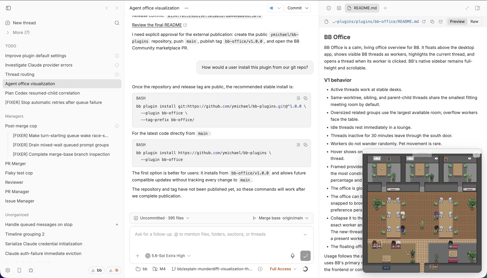

# BB Office

BB Office is a calm, living office overview for BB. It floats above the desktop app, shows visible BB threads as workers, highlights the current thread, and opens a thread when its worker is clicked. BB's native sidebar remains full-height and scrollable.



## V1 behavior

- Active threads work at stable desks.
- Same-worktree, sibling, and parent-child threads share the smallest fitting meeting room by default.
- Oversized related groups use the largest available room; overflow workers face the table.
- Idle threads rest immediately in a lounge.
- Threads inactive for 30 minutes leave through the south door.
- Workers do not wander randomly. Pet movement is rare.
- Hover shows only the worker name and provider. Clicking opens the BB thread.
- Framed provider-usage posters sit outside the meeting rooms. Each shows the most constrained usage window, while hover reveals the exact percentage and clicking opens BB's full Usage page.
- The office is global across BB and subtly follows the BB theme.
- The office can be dragged, resized from its outer corner, and gently snapped to browser edges. Its size, fixed position, and expanded/collapsed preference persist on that device.
- Collapse it to the current thread's 72×72 worker. Expansion grows from that exact worker anchor and collapse returns to it without changing position. The new-thread route shows a floorplan icon instead, while threads without a present worker hide the collapsed control.
- The floating office is hidden on compact/mobile viewports.

Usage follows the active thread's machine when one is selected and otherwise uses BB's primary machine. BB Office never sends provider account email to the frontend or combines usage from different machines into one number.

## Privacy

BB Office uses only BB's local plugin APIs and does not contact a third-party service. Thread presentation stays inside BB, office configuration is stored in BB's plugin storage, and panel placement is stored locally on the device. Provider account email is removed before usage summaries reach the frontend.

## Install locally

From this repository root:

```bash
bb plugin install path:$(pwd) --plugin bb-office --yes
```

The repository collection is declared in `.bb/plugins.json`, so future plugins can live beside BB Office under `plugins/`.

## Customize it

Ask an agent in BB to customize the BB Office. The bundled skill uses a safe read → preview → apply workflow and requires approval before committing a proposal.

The same interface is available from the CLI:

```bash
bb office show
bb office preview --revision 0 --appearance neutral --leave-after 15 --pets hide
bb office apply PROPOSAL_ID --revision 0
```

Run `bb office help` for every v1 control. One global configuration applies to the entire BB office, and the command works without project context. Raw tiles, collision masks, routes, and arbitrary code are intentionally not configurable in v1.

## Development

```bash
corepack pnpm install
corepack pnpm exec turbo run typecheck test build --filter=bb-plugin-bb-office
```

See [ATTRIBUTION.md](ATTRIBUTION.md) for included upstream code, art, and icon provenance.
